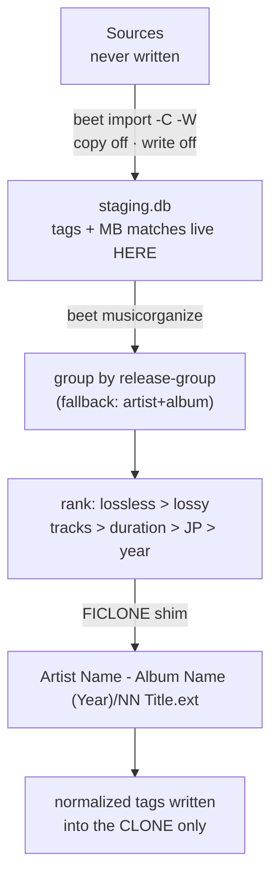

# music-organizer

Curate a well-organized, **deduplicated** copy of the music library under
`/mnt/largepool/bulk/MediaLibrary/Music`, built out of **reflink clones**
(`cp --reflink=always` semantics) so the copy costs inodes, not gigabytes.

Companion to [`media-organizer`](../media-organizer), which does the same for
video. Same house rules, same hard-won gotchas.

> **Sloppy-code warning.** Unreviewed, AI-written, environment-specific. Read
> it before you run it, and check the paths.

## What it does

Sources (strictly **read-only**):

```
/mnt/largepool/bulk/Music/CleanFLAC   lossless archives
/mnt/largepool/bulk/Music/VGM         sequenced music
/mnt/largepool/bulk/Music/CleanMP3    lossy
```

Destination: `/mnt/largepool/bulk/MediaLibrary/Music`.



Two phases, deliberately:

1. **Index** — `beet import -C -W`: no copy, no write. MusicBrainz matches are
   stored in the *database*, so a source file's bytes (and therefore its
   checksum) never change. `incremental` makes re-runs cheap.
2. **Organize** — `beet musicorganize`: picks one winner per work, clones only
   that, and writes clean tags into the clone.

Cloning is a separate pass on purpose. Cloning first and deleting losers later
is expensive on ZFS for no benefit: freeing shared blocks churns the
block-reference table, and `rm` of a reflinked tree sits in `D` state for
minutes (documented in `media-organizer/README.md`).

## Naming

```
<albumartist> - <album> (<year>)/
    <track> <title>.<ext>
```

beets zero-pads `$track` to two digits (`01`, `02`, …, `12`), so "number on
top" needs no template work. Verified against a real album on the pool.

## Why there is a `shim/`

beets' `reflink` option does `import_module("reflink")` — the PyPI package.
That package clones and *then* `copystat`s, which fails on
`aclmode=restricted` ZFS:

```
OSError: Could not copy permissions (errno EPERM)
```

So, without `shim/reflink.py`:

* `reflink: yes` → every clone aborts with a `FilesystemError`;
* `reflink: auto` → the clone works, the `copystat` fails, and beets
  **silently falls back to a byte copy** — full space, no warning.

`shim/reflink.py` is a bare `FICLONE` ioctl (`fcntl.ioctl(dst, 0x40049409,
src)`), stdlib only. Its semantics are exactly `cp --reflink=always`: shared
blocks, no metadata copying, and a real error if the clone fails.

It is put on `PYTHONPATH` so it shadows any installed `reflink` distribution.

## Install

```sh
./install.sh          # venv, shim, program files, systemd user units
./install.sh --dry-run
```

Then:

```sh
systemctl --user daemon-reload
systemctl --user enable --now music-organizer-index.timer
systemctl --user list-timers music-organizer-index.timer
```

`install.sh` installs into `~/music-organizer` (override with
`MUSIC_ORGANIZER_PREFIX`) and units into `~/.config/systemd/user`. It does not
enable or start anything — that is yours to do.

### First run by hand

```sh
export BEETSDIR=~/music-organizer PYTHONPATH=~/music-organizer/shim
B=~/music-organizer/.venv/bin/beet

# 1. index (read-only over the sources)
$B -c ~/music-organizer/config.yaml import -C -W \
   /mnt/largepool/bulk/Music/CleanFLAC /mnt/largepool/bulk/Music/VGM

# 2. curate — always dry-run first
$B -c ~/music-organizer/config.yaml musicorganize -n
$B -c ~/music-organizer/config.yaml musicorganize
```

## `beet musicorganize`

```
beet musicorganize [-n] [-f] [-d DEST] [QUERY...]

  -n, --dry-run   show what would be cloned, change nothing
  -f, --force     re-clone even if already organized
  -d, --dest      destination root (default: plugin config `dest`)
```

Grouping identity: `mb_releasegroupid` when MusicBrainz supplied one,
otherwise case-folded `albumartist` + `album`.

Winner ranking, highest wins:

| # | Criterion | Why |
|---|---|---|
| 1 | fraction of lossless tracks | lossless > lossy |
| 2 | number of tracks | covers "Japanese CDs have more tracks" |
| 3 | total duration | same, second order |
| 4 | `country == JP` | Japanese release > rest of the world |
| 5 | earliest year | deterministic-ish tie-break |

Re-running is safe: the original path is stashed in the flexible attribute
`mo_source`, and any item carrying it is skipped unless `--force`. Losers get
`mo_role=alternate` and `mo_group=<key>`, so the alternates are discoverable
without being cloned.

## Known limits

* **Grouping is a heuristic for 98% of the library.** Sampled 400 real FLACs:
  `MUSICBRAINZ_ALBUMID` in 4%, `MUSICBRAINZ_RELEASEGROUPID` in 2%,
  `RELEASECOUNTRY` in 2%. Autotag fills those in the DB where it can match;
  what it cannot match falls back to artist+album, which merges distinct
  pressings that share both. That is the requested "one release per work", but
  it will occasionally be wrong.
* **JP preference works on `country`, which is usually absent** for unmatched
  albums. Where it is absent, the track-count and duration rules decide — which
  is exactly what was specified, but it means "JP wins" is inferred from
  running order, not from a country tag.
* **Tag writing changes the clone's checksum.** Intended: the clone is the
  mutable object; the source is hash-verified as unchanged.

## Verifying it did not cost space, and did not touch a source

```sh
# on the host that owns the pool (the container has no `zfs`)
zfs get -Hp -o value used /mnt/largepool/bulk     # before / after -> delta ~0

# a clone's blocks are shared, so it reports almost no blocks of its own
stat -c '%n size=%s blocks=%b' <clone> <source>
```

Measured on this pool: source `blocks=33504`, the FICLONE clone `blocks=1`.
